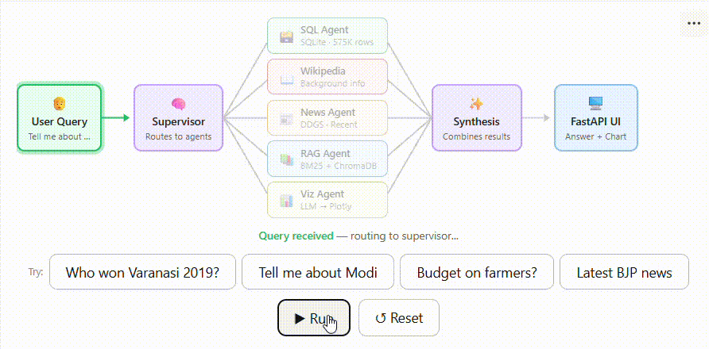

# 🗳️ India Election Intelligence Agent

A multi-agent AI system for querying and analyzing Indian election data from 1962 to 2019, powered by LangGraph.



## 🎥 Video Walkthrough
[](https://youtu.be/BkbhJby8kPM)

## 🚀 Live Demo
[](https://huggingface.co/spaces/shan1322/election-intel-agent)

## What it does

Ask any question about Indian elections in plain English and the system automatically routes it to the right agents, queries the database, searches the web, retrieves policy documents, and generates visualizations — all in one response.

**Example queries:**
- Who won Varanasi in 2019?
- Show voter turnout trend in Varanasi across all elections
- What did the 2019 budget say about farmers?
- Tell me about Narendra Modi
- BJP vs INC seats in 2019 Lok Sabha
- Latest news about Rahul Gandhi

## Architecture

The system uses a LangGraph state machine to orchestrate 5 specialized agents:

| Agent | Purpose |
|---|---|
| SQL Agent | Queries SQLite election database (575K rows, 1962–2019) |
| Wikipedia Agent | Fetches background on politicians, parties, constituencies |
| News Agent | Searches recent news via DuckDuckGo |
| RAG Agent | Searches budget speeches (1947–2026) and President addresses (1952–2026) via BM25 + ChromaDB |
| Visualization Agent | LLM writes Plotly code to auto-generate charts |

## Data Sources

- **Election results** — Lok Sabha and Vidhan Sabha data from [Lok Dhaba](https://lokdhaba.ashoka.edu.in), 1962–2019
- **Budget speeches** — All Union Budget speeches 1947–2026 from indiabudget.gov.in (91 PDFs)
- **President addresses** — All Presidential addresses to Parliament 1952–2026 from PRS India (70 PDFs)
- **RAG corpus** — 3,229 chunks, ~1.4M words

## Tech Stack

- **LLM** — Llama 3.1 8B via HuggingFace Router API
- **Agent framework** — LangGraph
- **Vector DB** — ChromaDB (local persistent)
- **Hybrid search** — BM25 (rank-bm25) + ChromaDB cosine similarity
- **Embeddings** — sentence-transformers/all-MiniLM-L6-v2
- **Backend** — FastAPI + Uvicorn
- **Frontend** — Vanilla HTML/JS + Plotly
- **Deployment** — HuggingFace Spaces (Docker)

## Setup

```bash
git clone https://github.com/shan1322/Election-Intelligence-agent
cd Election-Intelligence-agent
pip install -r requirements.txt
export HF_TOKEN=your_token_here
python app.py
```

## Environment Variables

| Variable | Description |
|---|---|
| `HF_TOKEN` | HuggingFace API token for LLM inference |
